# Project Report: AngularMovieAppV2

## Abstract

AngularMovieAppV2 is a web application developed to provide users with an intuitive platform for discovering movie and TV show information and trailers. Leveraging the comprehensive data from The Movie Database (TMDB) API, the application offers features such as browsing by categories, searching for specific titles or personalities, and viewing detailed information including cast, crew, ratings, and media. The project aims to deliver a responsive and engaging user experience for movie and TV show enthusiasts.

## 1. Introduction

### 1.1 Overview of Online Movie/TV Show Discovery Platforms

Online movie and TV show discovery platforms have become essential tools for audiences worldwide. In an era of abundant digital content and numerous streaming services, these platforms help users navigate the vast landscape of available entertainment. They typically provide curated lists, search functionalities, detailed information, ratings, reviews, and links to watch trailers or full content, thereby centralizing the discovery process.

### 1.2 Importance of Such Platforms for Entertainment and Discovery

The sheer volume of movies and TV shows released makes it challenging for individuals to keep track of new content or find titles that align with their interests. Discovery platforms address this by:
*   **Aggregating Information:** Bringing together data from various sources, including official releases, cast and crew details, and user-generated ratings.
*   **Personalization:** Offering recommendations based on viewing history or user preferences (though this app primarily focuses on discovery via TMDB).
*   **Facilitating Choice:** Enabling users to make informed decisions about what to watch next.
*   **Community Engagement:** Often incorporating social features like reviews and discussion forums (not a primary focus of this specific application).

### 1.3 Use Case Scenarios

Users typically engage with such platforms for various reasons:
*   **Finding New Releases:** Staying updated with the latest movies in theaters or new TV show episodes.
*   **Exploring Specific Genres:** Searching for content within preferred genres like action, comedy, drama, sci-fi, etc.
*   **Checking Ratings and Reviews:** Evaluating whether a movie or show is worth watching based on critical or user feedback.
*   **Watching Trailers:** Getting a preview of a movie or show before committing to watching it.
*   **Discovering "Hidden Gems":** Finding lesser-known titles or older movies and shows.
*   **Learning More About Cast/Crew:** Looking up information about actors, directors, and other production members.
*   **Tracking Watched Content:** Some platforms allow users to maintain watchlists or mark content as watched (a potential future enhancement for this app).

This project, AngularMovieAppV2, aims to provide a streamlined solution for several of these use cases, primarily focusing on discovery, information retrieval, and trailer viewing.

## 2. Objective

The primary objectives for the development of the AngularMovieAppV2 project are as follows:

*   **To build a responsive and user-friendly web-based system** that allows users to efficiently discover, explore, and learn about movies and TV shows.
*   **To provide an intuitive and engaging user interface (UI)** for seamless browsing, searching, and navigation across different categories of media content.
*   **To integrate effectively with The Movie Database (TMDB) API** to fetch and display a wide range of data, including movie/TV show details, trailers, cast and crew information, genres, and recommendations.
*   **To enable users to watch trailers directly within the application,** enhancing the discovery experience.
*   **To structure the application using modern Angular practices,** including component-based architecture, services for API interaction, and routing for navigation, ensuring maintainability and scalability.
*   **To offer specific features** such as viewing content by categories (e.g., "Now Playing," "Popular," "Top Rated"), by genre, and accessing detailed profiles for individual movies, TV shows, and personalities.

## 3. Technology Stack

| Component             | Technology                                      | Version(s)      |
|-----------------------|-------------------------------------------------|-----------------|
| **Frontend**          | HTML, SCSS (Sassy CSS)                          | N/A             |
| **Framework**         | Angular                                         | ^18.1.0         |
| **Language**          | TypeScript                                      | ~5.5.2          |
| **State Management**  | @ngrx/store                                     | ^18.0.2         |
| **HTTP Client**       | Angular HttpClientModule                        | (part of Angular) |
| **Async Operations**  | RxJS (Reactive Extensions for JavaScript)       | ~7.8.0          |
| **Loading Indicators**| ngx-spinner                                     | ^17.0.0         |
| **Routing**           | Angular Router                                  | (part of Angular) |
| **API**               | TMDB (The Movie Database) REST API              | v3              |
| **Development Tools** | Angular CLI                                     | ^18.1.3         |
|                       | Visual Studio Code (or other IDEs)              | N/A             |
|                       | Git & GitHub (Version Control)                  | N/A             |
|                       | Browser Developer Tools                         | N/A             |
| **Package Manager**   | npm / yarn                                      | N/A             |

## 4. System Design

### a. Architecture Diagram

The following diagram illustrates the overall architecture of the AngularMovieAppV2 application, showcasing the interaction between different layers and components, from the client-side rendering in the browser to the external TMDB API.

```mermaid
flowchart TD
    %% Hosting Layer
    StaticHost["Static File Host<br/>(CDN / Firebase)"]:::hosting
    click StaticHost "https://github.com/absterrg0/angular-project/tree/main/public/"

    %% Browser Client Container
    subgraph "Browser / Client" 
        direction TB

        %% Bootstrap & AppModule
        MainEntry["Bootstrap Entry Point<br/>src/main.ts"]:::service
        click MainEntry "https://github.com/absterrg0/angular-project/blob/main/src/main.ts"
        AppModule["AppModule<br/>src/app/app.module.ts"]:::service
        click AppModule "https://github.com/absterrg0/angular-project/blob/main/src/app/app.module.ts"
        RootComp["AppComponent<br/>src/app/app.component.ts"]:::frontend
        click RootComp "https://github.com/absterrg0/angular-project/blob/main/src/app/app.component.ts"

        %% Routing Layer
        Routing["Routing Module<br/>src/app/app-routing.module.ts"]:::service
        click Routing "https://github.com/absterrg0/angular-project/blob/main/src/app/app-routing.module.ts"

        %% Service Layer
        subgraph "Service Layer" 
            direction TB
            HttpClient["HttpClientModule"]:::service
            ApiService["ApiService<br/>src/app/api/api.service.ts"]:::service
            click ApiService "https://github.com/absterrg0/angular-project/blob/main/src/app/api/api.service.ts"
        end

        %% Presentation Layer
        subgraph "Feature Components" 
            direction TB
            Home["HomeComponent"]:::frontend
            click Home "https://github.com/absterrg0/angular-project/blob/main/src/app/components/home/home.component.ts"
            Movies["MoviesComponent"]:::frontend
            click Movies "https://github.com/absterrg0/angular-project/blob/main/src/app/components/movies/movies.component.ts"
            TV["TvComponent"]:::frontend
            click TV "https://github.com/absterrg0/angular-project/blob/main/src/app/components/tv/tv.component.ts"
            Genre["GenreComponent"]:::frontend
            click Genre "https://github.com/absterrg0/angular-project/blob/main/src/app/components/genre/genre.component.ts"
            MoviesInfo["MoviesInfoComponent"]:::frontend
            click MoviesInfo "https://github.com/absterrg0/angular-project/blob/main/src/app/components/movies-info/movies-info.component.ts"
            TvInfo["TvInfoComponent"]:::frontend
            click TvInfo "https://github.com/absterrg0/angular-project/blob/main/src/app/components/tv-info/tv-info.component.ts"
            Person["PersonComponent"]:::frontend
            click Person "https://github.com/absterrg0/angular-project/blob/main/src/app/components/person/person.component.ts"
            MovieCat["MovieCategoryComponent"]:::frontend
            click MovieCat "https://github.com/absterrg0/angular-project/blob/main/src/app/components/movie-category/movie-category.component.ts"
            TvCat["TvCategoryComponent"]:::frontend
            click TvCat "https://github.com/absterrg0/angular-project/blob/main/src/app/components/tv-category/tv-category.component.ts"
        end

        subgraph "Shared Components & Pipes" 
            direction TB
            Carousel["Carousel"]:::shared
            click Carousel "https://github.com/absterrg0/angular-project/blob/main/src/app/components/global/carousel/carousel.component.ts"
            Episodes["Episodes"]:::shared
            click Episodes "https://github.com/absterrg0/angular-project/blob/main/src/app/components/global/episodes/episodes.component.ts"
            Footer["Footer"]:::shared
            click Footer "https://github.com/absterrg0/angular-project/blob/main/src/app/components/global/footer/footer.component.ts"
            Hero["Hero"]:::shared
            click Hero "https://github.com/absterrg0/angular-project/blob/main/src/app/components/global/hero/hero.component.ts"
            Images["Images"]:::shared
            click Images "https://github.com/absterrg0/angular-project/blob/main/src/app/components/global/images/images.component.ts"
            Listing["Listing"]:::shared
            click Listing "https://github.com/absterrg0/angular-project/blob/main/src/app/components/global/listing/listing.component.ts"
            Media["Media"]:::shared
            click Media "https://github.com/absterrg0/angular-project/blob/main/src/app/components/global/media/media.component.ts"
            Modal["Modal"]:::shared
            click Modal "https://github.com/absterrg0/angular-project/blob/main/src/app/components/global/modal/modal.component.ts"
            Navbar["Navbar"]:::shared
            click Navbar "https://github.com/absterrg0/angular-project/blob/main/src/app/components/global/navbar/navbar.component.ts"
            Slider["Slider"]:::shared
            click Slider "https://github.com/absterrg0/angular-project/blob/main/src/app/components/global/slider/slider.component.ts"
            Videos["Videos"]:::shared
            click Videos "https://github.com/absterrg0/angular-project/blob/main/src/app/components/global/videos/videos.component.ts"
            Pipes["Pipes"]:::shared
            click Pipes "https://github.com/absterrg0/angular-project/blob/main/src/app/components/global/pipe/*.pipe.ts"
            GlobalSearch["SearchComponent"]:::shared
            click GlobalSearch "https://github.com/absterrg0/angular-project/blob/main/src/app/components/global/search/search.component.ts"
        end

        %% Assets & Styles
        Styles["Assets & Styling<br/>styles.scss, /assets/css, /assets/images"]:::service
        click Styles "https://github.com/absterrg0/angular-project/blob/main/src/styles.scss"
    end

    %% External API
    TMDB["TMDB REST API"]:::external

    %% Data Flows
    StaticHost -->|"serves index.html + assets"| MainEntry
    MainEntry --> AppModule
    AppModule --> RootComp
    AppModule --> Routing
    Routing -->|"routes to"| Home
    Routing --> Movies
    Routing --> TV
    Routing --> Genre
    Routing --> MoviesInfo
    Routing --> TvInfo
    Routing --> Person
    Routing --> MovieCat
    Routing --> TvCat

    Home --> ApiService
    Movies --> ApiService
    TV --> ApiService
    Genre --> ApiService
    MoviesInfo --> ApiService
    TvInfo --> ApiService
    Person --> ApiService
    MovieCat --> ApiService
    TvCat --> ApiService

    ApiService -->|"HTTP GET"| TMDB
    TMDB -->|"JSON Response"| ApiService

    classDef frontend fill:#D0E8FF,stroke:#0366d6,color:#0366d6;
    classDef shared fill:#E8FFF1,stroke:#28a745,color:#28a745;
    classDef service fill:#FFF5E5,stroke:#ff8c00,color:#ff8c00;
    classDef external fill:#F0F0F0,stroke:#6a737d,color:#6a737d,stroke-dasharray: 5 5;
    classDef hosting fill:#F3E5FF,stroke:#6f42c1,color:#6f42c1;
```

*(Note: The rendering of this Mermaid diagram depends on the Markdown viewer's capabilities.)*

### b. Component Description

The application is built using a component-based architecture, typical of Angular projects. Key components include:

*   **`AppComponent` (`src/app/app.component.ts`):** The root component of the application, acting as the main container for all other components. It typically includes the router outlet for displaying views based on navigation.
*   **`ApiService` (`src/app/api/api.service.ts`):** An Angular service responsible for all interactions with the external TMDB API. It encapsulates the HTTP requests, API key management (currently hardcoded), and data transformation logic for various endpoints like fetching movies, TV shows, genres, credits, etc.
*   **`AppRoutingModule` (`src/app/app-routing.module.ts`):** Defines the application's navigation paths, mapping URLs to specific Angular components. This enables different views for home, movie lists, TV show lists, detailed info pages, genre pages, etc.
*   **Feature Components (e.g., `HomeComponent`, `MoviesComponent`, `TvComponent`, `MoviesInfoComponent`, `TvInfoComponent`, `PersonComponent`, `GenreComponent`, `MovieCategoryComponent`, `TvCategoryComponent`):** These components are responsible for specific views and functionalities. For example:
    *   `HomeComponent`: Displays the main landing page, often showcasing trending or popular content.
    *   `MoviesComponent` / `TvComponent`: List movies or TV shows, possibly with filtering or pagination.
    *   `MoviesInfoComponent` / `TvInfoComponent`: Show detailed information about a selected movie or TV show, including synopsis, cast, trailers, and recommendations.
    *   `PersonComponent`: Displays details about an actor or crew member.
*   **Global/Shared Components (e.g., `NavbarComponent`, `FooterComponent`, `CarouselComponent`, `SliderComponent`, `ListingComponent`, `SearchComponent`):** Reusable UI elements used across multiple feature components.
    *   `NavbarComponent`: Provides the main navigation bar for the application.
    *   `CarouselComponent` / `SliderComponent`: Used for displaying scrollable lists of media items, often for featured content or recommendations.
    *   `ListingComponent`: A generic component likely used to display lists of movies or TV shows in a consistent format.
    *   `SearchComponent`: Provides the user interface and logic for searching media.

### c. Data Flow

The data flow in AngularMovieAppV2 primarily revolves around user interactions triggering API calls and the subsequent display of fetched data:

1.  **User Interaction:** A user navigates to a page (e.g., clicks on a movie category, performs a search, or selects a movie for details).
2.  **Component Action:** The relevant Angular component associated with the current route captures this interaction.
3.  **API Service Call:** The component then calls methods in the `ApiService`, passing necessary parameters (like movie ID, search query, page number, or category type).
4.  **HTTP Request:** `ApiService` constructs and sends an HTTP request (typically GET) to the appropriate TMDB API endpoint using Angular's `HttpClientModule`.
5.  **API Response:** The TMDB API returns data in JSON format.
6.  **Data Processing (Service/Component):** `ApiService` receives the JSON response. It might perform some initial processing or directly return the Observable stream to the component.
7.  **State Management (NgRx Store):** Although not explicitly detailed in file previews, the inclusion of `@ngrx/store` suggests that for some data (e.g., user session, complex UI states, or cached API responses), the application might dispatch actions to a store. Reducers would then update the state, and components would subscribe to state changes via selectors. For simpler data fetches, components might subscribe directly to the `ApiService` observables.
8.  **View Update:** The component, having received the data (either directly from the service or via the NgRx store), updates its properties. Angular's change detection mechanism then re-renders the relevant parts of the template, displaying the new information to the user.
9.  **Asynchronous Handling:** RxJS Observables are used throughout this process to handle asynchronous operations like API calls, allowing components to react to data once it arrives without blocking the UI.

The `AppRoutingModule` plays a crucial role in orchestrating which component is active and often passes parameters (like IDs) from the URL to components, which then use these parameters for their data fetching logic.

## 5. Modules and Features

The AngularMovieAppV2 application is organized into several functional modules and offers a rich set of features for movie and TV show discovery.

### Key Features:

*   **Homepage Display:** Presents a curated view, potentially showcasing trending, popular, or now-playing movies and TV shows.
*   **Movie Listing & Details:**
    *   Dedicated sections for browsing movies (`/movie`).
    *   Movies categorized by "Popular," "Now Playing," "Top Rated," "Upcoming."
    *   Detailed movie information page (`/movie/:id`) showing synopsis, poster, backdrop images, cast, crew, recommendations, and trailers.
*   **TV Show Listing & Details:**
    *   Dedicated sections for browsing TV shows (`/tv`).
    *   TV shows categorized by "Popular," "Airing Today," "On The Air," "Top Rated."
    *   Detailed TV show information page (`/tv/:id`) showing overview, poster, backdrop images, seasons, episodes, cast, crew, recommendations, and trailers.
*   **Genre-Based Discovery:**
    *   Browse movies and TV shows by specific genres (`/genres/:id/:type`).
    *   Lists available genres for movies and TV shows.
*   **Person/Actor Profiles:**
    *   View detailed information about actors and potentially other crew members (`/person/:id`), including biography, filmography, and images.
*   **Search Functionality:**
    *   Comprehensive search (`/search`) for movies, TV shows, and people.
*   **Trailer Viewing:**
    *   Integrated video player (via `VideosComponent`, likely using YouTube embeds) to watch trailers directly within the application.
*   **Responsive User Interface:** Adapts to various screen sizes for optimal viewing on desktops, tablets, and mobile devices.
*   **Loading Indicators:** Uses `ngx-spinner` to provide visual feedback during data fetching operations.

### Angular Features Utilized:

*   **Component-Based Architecture:** The application is built as a tree of components, promoting reusability and separation of concerns. (e.g., `HomeComponent`, `MoviesComponent`, `MoviesInfoComponent`, `NavbarComponent`, `CarouselComponent`).
*   **Services and Dependency Injection:** `ApiService` is a prime example, encapsulating data access logic and being injected into components that require it.
*   **Routing (`AppRoutingModule`):** Manages navigation between different views and components, supporting parameterized routes for dynamic content (e.g., `movie/:id`).
*   **HttpClient (`HttpClientModule`):** Used within `ApiService` for making asynchronous HTTP requests to the TMDB API.
*   **RxJS (Observables & Operators):** Extensively used for handling asynchronous API responses, managing event streams, and composing complex async logic (e.g., in `ApiService` and component data subscriptions).
*   **Directives (Structural & Attribute):**
    *   Standard directives like `*ngIf`, `*ngFor` are used for conditional rendering and list generation in templates.
    *   Likely custom attribute directives for UI enhancements or behavior (though not explicitly listed in provided file names).
*   **Pipes (`src/app/components/global/pipe/`):** Custom pipes are likely used for data transformation directly in templates (e.g., formatting dates, truncating text, image URL construction). The existence of a `pipe` directory suggests this.
*   **Input/Output Decorators (`@Input()`, `@Output()`):** Used for communication between parent and child components, allowing property binding and event emission.
*   **Forms (`FormsModule`, `ReactiveFormsModule`):** Used for handling user input, particularly in the search functionality. `package.json` lists `@angular/forms`.
*   **State Management (`@ngrx/store`):** While the depth of its integration isn't fully detailed from the file list, its inclusion indicates a centralized approach to managing at least some aspects of application state, promoting unidirectional data flow and better state predictability for complex interactions.
*   **Lazy Loading (Potentially):** Though not explicitly confirmed from the provided `AppRoutingModule` snippet, larger Angular applications often use lazy loading for feature modules to improve initial load time. This could be a feature of the full routing setup.
*   **Environment Variables (Implied Best Practice):** While the API key is currently hardcoded, Angular CLI supports environment files (`environment.ts`) for managing such configurations, which would be a standard feature to leverage.
